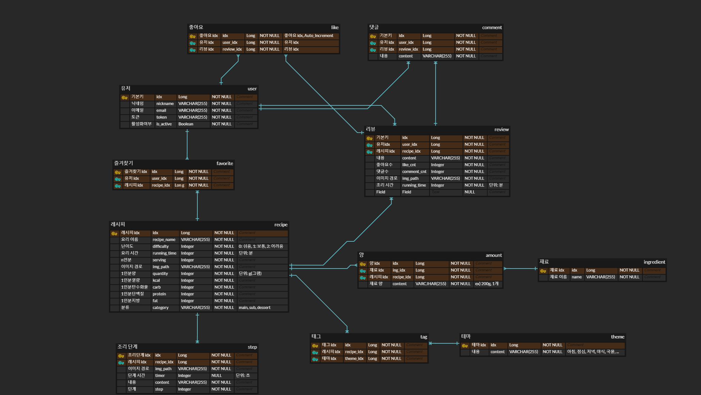

# 2023-09-08

## 목업 확인 및 팀 회의

[Cocook 목업](https://www.figma.com/file/u83HRrNeDlQm7oqFonlJan/Cocook?node-id=1%3A3&t=kv14b28wUfQUj7rO-1)

## API 명세 초안 작성

## 전문가 리뷰

- 레시피 제어

스피치 커멘드라는 기능이 있음. 음성인식 API등 큰 모델을 쓸 필요 없고, 이 영역에 맞는 도메인만 학습하면 끝.

- 각자 녹음, 합성 데이터를 이용하여 학습하면 좋을 것 같음(구글, 네이버 합성 데이터 이용)
- 모든 화자의 명령어를 학습. 명령 데이터셋을 정의하고 데이터를 수집하고, 데이터는 다양한 화자로 수집.
- ResNet 모델 추천, 200~300개의 발화 수집
- Augmentation 방법을 사용하여 데이터 증폭. Audio Augmentation, 노이즈를 많이 섞어서 학습하는게 좋음
- 다음 화면 명령이 있는데, 다음 화며라고 결과가 나오면 유사도를 측정하여 Cosine similarity, edit distance로 측정
- 무식하게 if-else는 안됨
- 냉털

딥러닝 필요없고, 음식의 DB를 가지고 와서 미리 대파와 파는 같은 거라고 처리를 해놓는다. 학습은 필요없으며 switch-case와 같은 분기 처리로 충분해 보인다.

- 음식 찾기

Object detection(객체 인식), 공부하기 좋음

이미 많은 딥러닝 모델이 있을 것이다.

클래스 당 1000장 이상이면 데이터 충분

- 추가 학습

1. 이미 있는 클래스 이므로, 그냥 다시 처음부터 재학습, fine-tuning 이라는 기술 -> 이미 학습을 완료한 모델을 미세 조정할 수 있는 기술
2. 새로운 요리일 경우 softmax fine-tuning

- 로직이 간단할 경우 백엔드와 AI 백엔드 같이, 복잡할 경우 따로 구성하고 모든 통신은 REST API로 처리
- NLP는 어렵다. 불가능
- 냉털에서 음성을 쌓아뒀다 하지 말고 그때그때 전송
- streaming이냐 시간 단위로 할 거냐 -> streaming 쉽지 않음, 차라리 버튼을 만들어서 버튼을 눌렀을 때 일정 시간 동안 음성을 태우는게 편함. Streaming은 쉽지 않다. 연속적으로 들어오는 음성을 끊어서 처리해야 하므로 어렵다. 발화가 끝나는 걸 인지하면 가능. 조금 불편해도 하나씩 입력 받는게 좋음
- 유사도 측정은 String으로 판별, 유사도 측정은 프론트, 백 어디서 하던 상관 없음.

유사도 측정 알고리즘은 구현이 간단.

# 2023-03-07

## ERD 작성

## SUB II 프로젝트 학습

[sub2](./sub2/)

# 2023-03-06

## 기능명세 작성

[https://docs.google.com/spreadsheets/d/1zkbUUTM7u95iIkUOWzOjrRlMH-YVcKjaYatXHJFF1fw/edit?usp=sharing](https://docs.google.com/spreadsheets/d/1zkbUUTM7u95iIkUOWzOjrRlMH-YVcKjaYatXHJFF1fw/edit?usp=sharing)

## ERD 초안 작성

